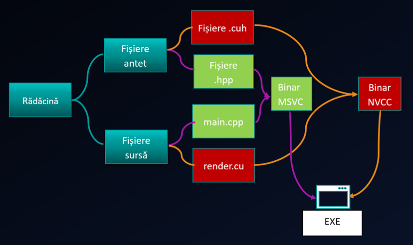
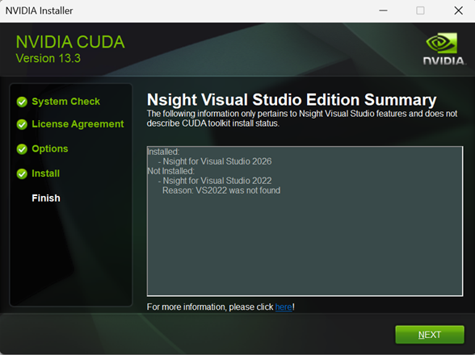
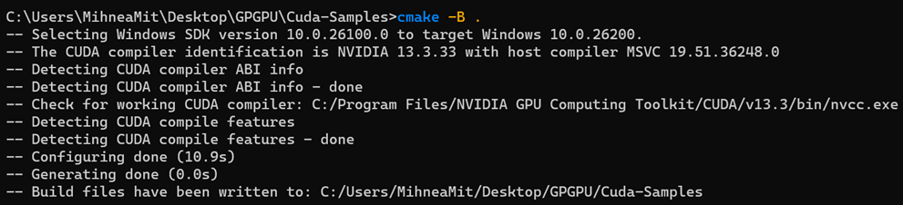

### Local Setup Steps

In the case you have an NVIDIA GPU on your local machine, the best way is to set up a local environment where you can compile and run CUDA samples.

In the following steps, I will walk you through the process of setting up your local environment for CUDA development. 

#### Instructions

As you already know, CUDA works only on NVIDIA GPUs, meaning it is not cross-vendor. 
On the other hand, being integrated in many environments, CUDA works on both Windows and Linux. We can't say that it is cross-platform since NVIDIA dropped support for macOS. To be honest, there are not many use cases for macOS in context of graphics programming and also not many NVIDIA GPUs are available for macOS.

We will be using CUDA locally based on the provided CUDA development packages for your system and build using CMake as build system. The following steps are for Windows, with Microsoft Visual Studio installed. The only difference for Linux is that you will need to install the CUDA development packages for your system and use Visual Studio Code.

1. On Windows, install Microsoft Visual Studio if you haven't already. You can download it from the [Visual Studio website](https://visualstudio.microsoft.com/). Make sure to select the "Desktop development with C++" workload during installation.

We will be using CMAKE and the compilation path for a hybrid computing cuda program is as shown below:



It is important to note that MSVC (Cpp compiler) and NVCC (NVIDIA CUDA Compiler) must work together to compile CUDA programs. The CMake build system will help you manage this process. If there are inconsistencies between the versions of MSVC and NVCC, you may encounter compilation errors. It took NVIDIA quite a while to make NVCC compatible with the latest versions of MSVC, so it is important to check the compatibility.
**Furthermore, it is important to have MSVC installed before installing the CUDA toolkit, as the CUDA installer will check for the presence of MSVC and configure itself accordingly!**



2. Install the CUDA toolkit for your system. You can find the installation packages on the [NVIDIA CUDA Toolkit website](https://developer.nvidia.com/cuda-downloads). Make sure to select the correct version for your operating system and architecture.
13.3 is the latest version at the time of writing this guide, I suggest you install that version. There is no need to install it if you already have an older version.

3. Install CMake for your system. You can download it from the [CMake website](https://cmake.org/download/). Make sure to add CMake to your system's PATH during installation.

4. Run the CMakeList.txt either from CMAKE GUI or from the command line. If you are using the command line, navigate to the directory containing the CMakeLists.txt file and run the following command:

```bash
# This creates the MSVC solution and project files in a build directory
cmake -S . -B build
# This builds the project using the generated MSVC solution and project files
cmake --build build --config Release
```
If everything is set up correctly, both compilers should be detected. Watch the console output for any errors or warnings.


You are all set! :)